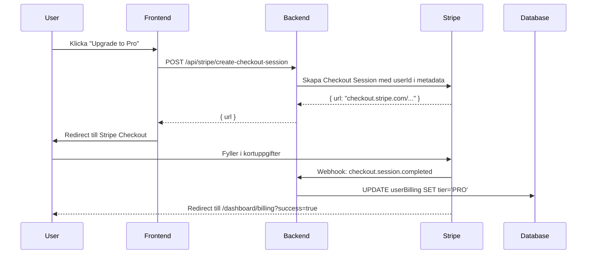

# 🚀 Stripe Checkout Integration - Setup Guide

Complete guide för att sätta upp Stripe checkout-flödet mellan frontend och backend.

---

## ✅ Vad som är klart (Frontend)

### 1. API Service Layer
- ✅ `billingApi.createCheckoutSession(priceId)` tillagd i `lib/api.ts`
- ✅ Anropar `POST /api/stripe/create-checkout-session` på backend

### 2. Upgrade Button Component
- ✅ `components/UpgradeButton.tsx` skapad
- ✅ Hanterar loading state och redirect till Stripe
- ✅ Döljer knappen automatiskt för PRO-användare

### 3. Billing Page Updated
- ✅ Importerar `UpgradeButton`
- ✅ Visar "Upgrade to Pro" för HOBBY-användare
- ✅ Visar "Manage Subscription" för PRO-användare

---

## 🔧 Steg för steg setup

### Steg 1: Skapa Stripe Price ID

1. Gå till [Stripe Dashboard](https://dashboard.stripe.com/products)
2. Skapa en ny produkt:
   - **Namn:** MemVault Pro
   - **Beskrivning:** Professional plan with 1M tokens/month
3. Lägg till pris:
   - **Typ:** Recurring (subscription)
   - **Belopp:** $99.00
   - **Intervall:** Monthly
4. **Kopiera Price ID** (ser ut som `price_1ABC123xyz...`)

### Steg 2: Konfigurera Frontend

Uppdatera `.env.local`:

```bash
NEXT_PUBLIC_STRIPE_PRO_PRICE_ID=price_1ABC123xyz...  # Din Price ID från Steg 1
```

### Steg 3: Lägg till Backend Endpoint

**Öppna ditt backend-repo** (Long-Term-Memory-API) och använd prompten i `BACKEND_CHECKOUT_PROMPT.md`

**TL;DR:** Lägg till detta i `src/routes/stripeRoutes.ts`:

```typescript
router.post('/create-checkout-session', hybridAuth, async (req: AuthenticatedRequest, res: Response, next: NextFunction) => {
  try {
    const userId = req.userContext?.userId;
    if (!userId) return res.status(401).json({ error: 'Unauthorized' });

    const { priceId } = req.body;
    if (!priceId) return res.status(400).json({ error: 'Price ID is required' });

    const user = await prisma.user.findUnique({
      where: { id: userId },
      select: { email: true },
    });

    const session = await stripe.checkout.sessions.create({
      mode: 'subscription',
      customer_email: user?.email || undefined,
      line_items: [{ price: priceId, quantity: 1 }],
      success_url: `${process.env.CORS_ORIGIN}/dashboard/billing?success=true`,
      cancel_url: `${process.env.CORS_ORIGIN}/dashboard/billing?canceled=true`,
      metadata: { userId },
    });

    return res.json({ url: session.url });
  } catch (err) {
    next(err);
  }
});
```

### Steg 4: Verifiera Webhook

Din webhook finns redan i `src/routes/webhookRoutes.ts` och hanterar:

✅ `checkout.session.completed` - Uppgraderar användare till PRO
✅ `invoice.payment_succeeded` - Rensar negativ balance
✅ `customer.subscription.deleted` - Nedgraderar till FREE

**Inget att ändra här!**

### Steg 5: Konfigurera Stripe Webhook (om ej redan gjort)

1. Gå till [Stripe Webhooks](https://dashboard.stripe.com/webhooks)
2. Lägg till endpoint:
   - **URL:** `https://moderate-krystal-memvault-af80fe26.koyeb.app/api/webhooks/stripe`
   - **Events:** Välj:
     - ✅ `checkout.session.completed`
     - ✅ `invoice.payment_succeeded`
     - ✅ `invoice.payment_failed`
     - ✅ `customer.subscription.deleted`
3. Kopiera **Webhook Secret** och lägg i backend `.env`:
   ```
   STRIPE_WEBHOOK_SECRET=whsec_...
   ```

---

## 🧪 Test-flöde

### Manuell testning:

1. **Starta dev-server:**
   ```bash
   npm run dev
   ```

2. **Navigera till Billing:**
   `http://localhost:3000/dashboard/billing`

3. **Klicka "Upgrade to Pro":**
   - Du redirectas till Stripe Checkout
   - Använd test-kort: `4242 4242 4242 4242`
   - Datum: Valfri framtida datum
   - CVC: Valfria 3 siffror

4. **Efter checkout:**
   - Redirectas tillbaka till `/dashboard/billing?success=true`
   - Webhook triggas automatiskt
   - Användaren uppgraderas till PRO i databasen
   - Sidan visar nu "Manage Subscription" istället för "Upgrade"

### Webhook-testning med Stripe CLI:

```bash
stripe listen --forward-to https://moderate-krystal-memvault-af80fe26.koyeb.app/api/webhooks/stripe
stripe trigger checkout.session.completed
```

---

## 📊 Vad händer när användaren köper?



---

## 🐛 Troubleshooting

### Problem: "Failed to create checkout session"
- ✅ Kontrollera att `NEXT_PUBLIC_STRIPE_PRO_PRICE_ID` är satt i `.env.local`
- ✅ Verifiera att backend endpoint finns och fungerar
- ✅ Kolla backend-loggar för fel

### Problem: Webhook får inte händelser
- ✅ Kontrollera webhook-URL i Stripe Dashboard
- ✅ Verifiera att `STRIPE_WEBHOOK_SECRET` är korrekt i backend
- ✅ Testa med Stripe CLI lokalt först

### Problem: Användaren uppgraderas inte efter betalning
- ✅ Kontrollera att `userId` finns i `session.metadata` i checkout-sessionen
- ✅ Kolla webhook-loggar i backend för `checkout.session.completed`
- ✅ Verifiera att `userBilling.update()` körs i webhook-handler

---

## 📚 Relaterade filer

### Frontend:
- `lib/api.ts` - API service med checkout-metod
- `components/UpgradeButton.tsx` - Upgrade-knapp komponent
- `app/dashboard/billing/page.tsx` - Billing-sida med upgrade-flöde
- `.env.local` - Miljövariabler (Price ID)

### Backend:
- `src/routes/stripeRoutes.ts` - Stripe-routes (checkout + portal)
- `src/routes/webhookRoutes.ts` - Webhook-handler
- `src/middleware/hybridAuth.ts` - Auth middleware

---

## ✨ Nästa steg

Efter att checkout fungerar, överväg att lägga till:

1. **Success/Cancel-pages:**
   - `app/dashboard/billing/success/page.tsx`
   - `app/dashboard/billing/canceled/page.tsx`

2. **Email-notifikationer:**
   - Skicka välkomst-mail när användare uppgraderas
   - Påminnelser om förnyelse

3. **Proration:**
   - Hantera delbetalning vid upgrade mitt i perioden

4. **Multiple plans:**
   - Lägg till HOBBY-plan checkout också
   - Dynamiska priser baserat på vald plan

---

🎉 **Lycka till med integrationen!**
